build-lists: true
footer: @AdamMc331

# Intro To Android Application Development
### Adam McNeilly - @AdamMc331

---

# Download Android Studio

https://developer.android.com/studio/

---

# What We're Building


---

# Why?

1. Learn how to put views on a screen.
2. Learn how to interract with them (clicks, updating images)
3. Learn how to navigate from one screen to another.
4. Learn how to display a list. 

---

# Live Coding?

---

# Landing Page

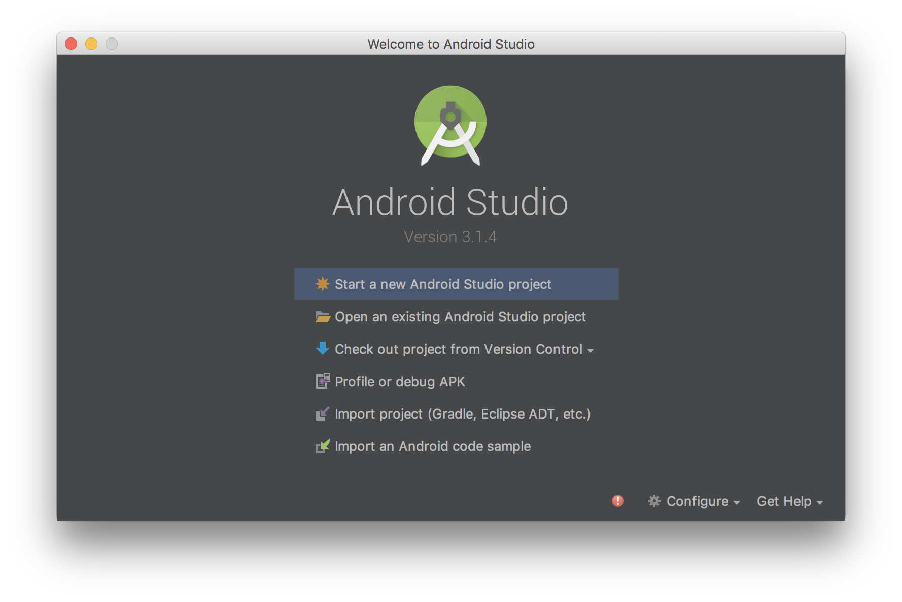

---

# Project Setup

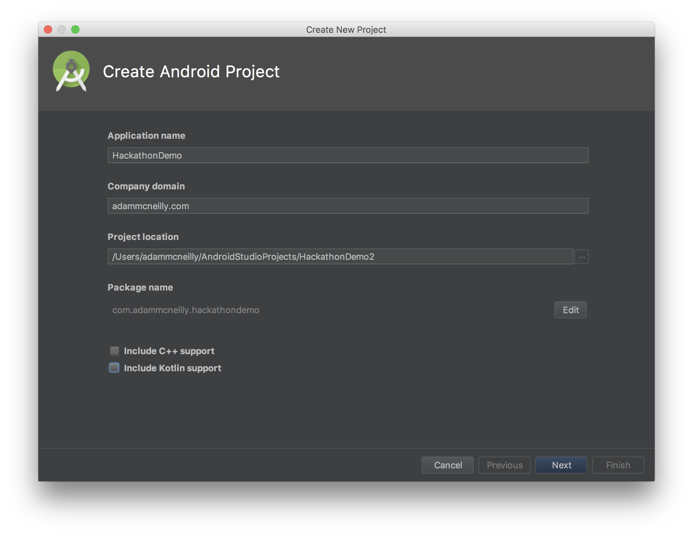

---

# Version Support

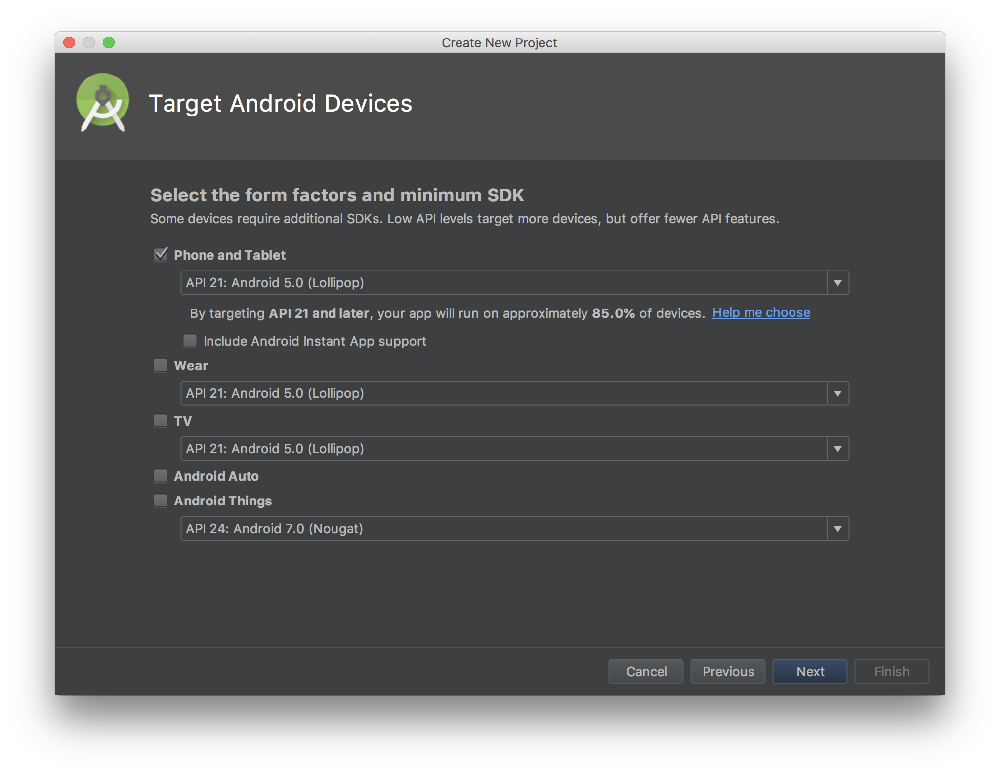

---

# Template

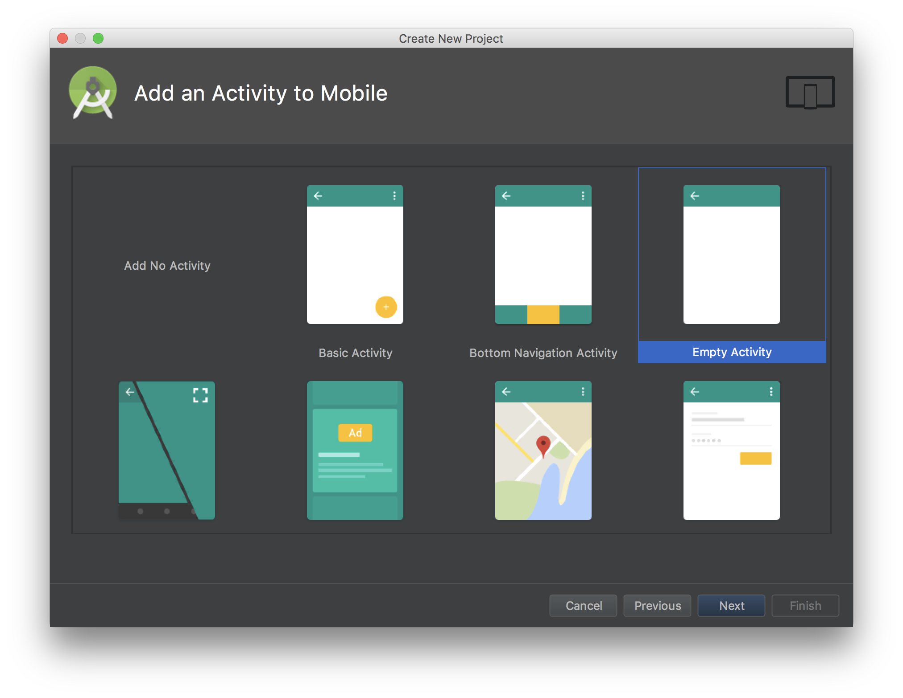

---

# Activity Naming

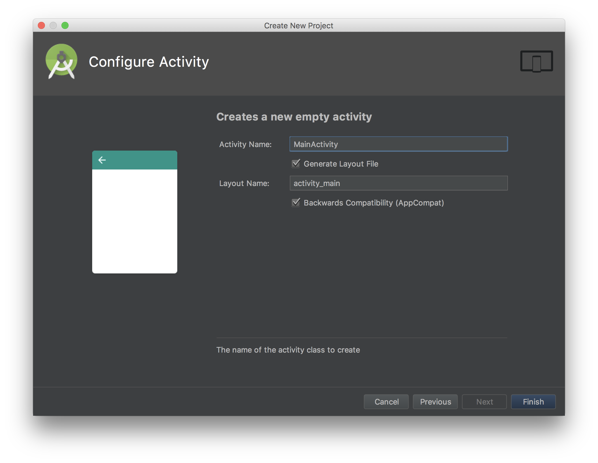

---

# Project Created

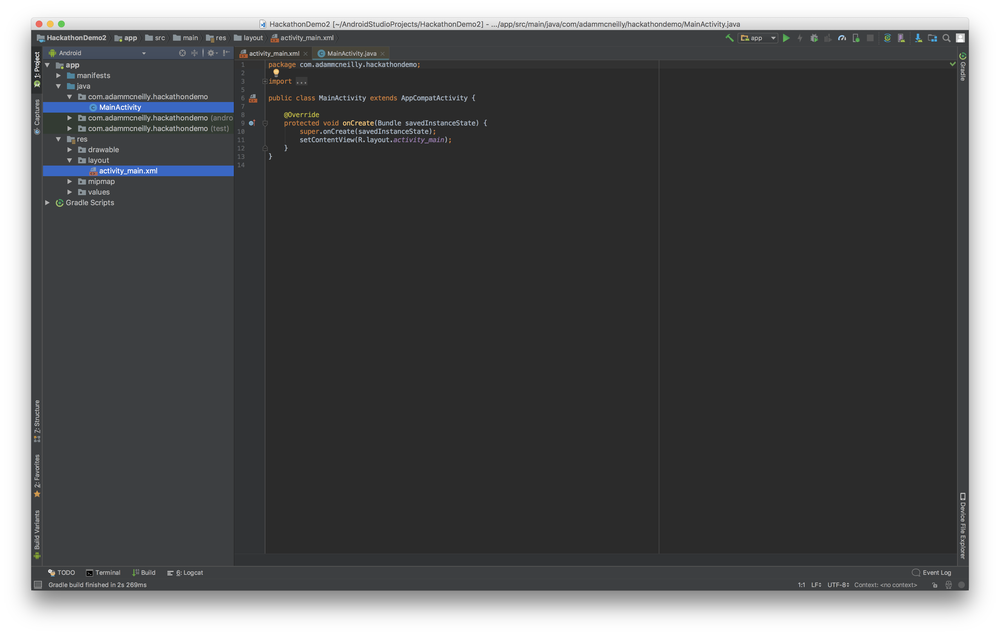

---

# Two Important Files To Start:

* `MainActivity.java`
* `activity_main.xml`

---

# MainActivity.java

[.code-highlight: all]
[.code-highlight: 6]
```java
public class MainActivity extends AppCompatActivity {

    @Override
    protected void onCreate(Bundle savedInstanceState) {
        super.onCreate(savedInstanceState);
        setContentView(R.layout.activity_main);
    }
}
```

---

# activity_main.xml

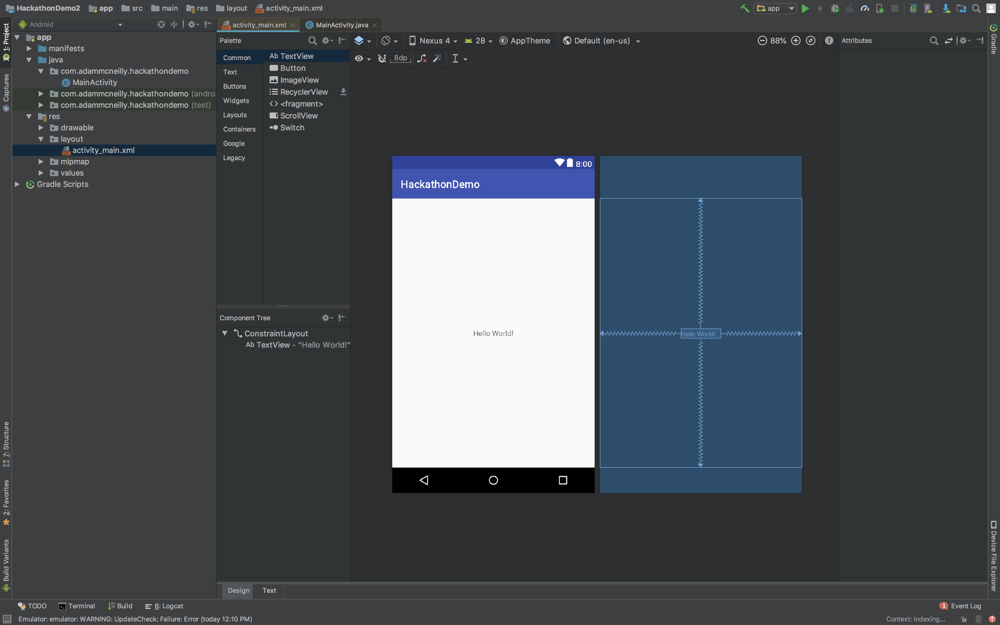

---

# activity_main.xml

```xml
<?xml version="1.0" encoding="utf-8"?>
<android.support.constraint.ConstraintLayout xmlns:android="http://schemas.android.com/apk/res/android"
    xmlns:app="http://schemas.android.com/apk/res-auto"
    xmlns:tools="http://schemas.android.com/tools"
    android:layout_width="match_parent"
    android:layout_height="match_parent"
    tools:context=".MainActivity">

    <TextView
        android:layout_width="wrap_content"
        android:layout_height="wrap_content"
        android:text="Hello World!"
        app:layout_constraintBottom_toBottomOf="parent"
        app:layout_constraintLeft_toLeftOf="parent"
        app:layout_constraintRight_toRightOf="parent"
        app:layout_constraintTop_toTopOf="parent" />

</android.support.constraint.ConstraintLayout>
```

---

# Setup Our App

---

# Add Images

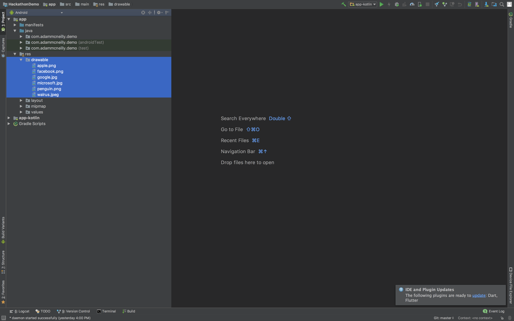

---

# Define Our Layout

[.code-highlight: all]
[.code-highlight: 1-6, 20]
[.code-highlight: 8-12]
[.code-highlight: 14-18]
```xml
<LinearLayout xmlns:android="http://schemas.android.com/apk/res/android"
    xmlns:tools="http://schemas.android.com/tools"
    android:layout_width="match_parent"
    android:layout_height="match_parent"
    android:orientation="vertical"
    tools:context="com.adammcneilly.demo.MainActivity">

    <ImageView
        android:id="@+id/my_image_view"
        android:layout_width="wrap_content"
        android:layout_height="wrap_content"
        android:src="@drawable/penguin" />

    <Button
        android:id="@+id/my_button"
        android:text="CHANGE PICTURE"
        android:layout_width="wrap_content"
        android:layout_height="wrap_content" />

</LinearLayout>
```

---

# Update Our Activity

[.code-highlight: all]
[.code-highlight: 2]
[.code-highlight: 9-11]
[.code-highlight: 13-24]
```java
public class MainActivity extends AppCompatActivity {
    private boolean showPenguin = true;

    @Override
    protected void onCreate(Bundle savedInstanceState) {
        super.onCreate(savedInstanceState);
        setContentView(R.layout.activity_main);

        // Get the view references
        final ImageView myImageView = findViewById(R.id.my_image_view);
        final Button myButton = findViewById(R.id.my_button);

        // Set a click listener on the button to toggle the image
        myButton.setOnClickListener(new View.OnClickListener() {
            @Override
            public void onClick(View v) {
                // Toggle the state
                showPenguin = !showPenguin;

                // Display corresponding image
                int resource = showPenguin ? R.drawable.penguin : R.drawable.walrus;
                myImageView.setImageResource(resource);
            }
        });
    }
}
```

---

# Progress


---

# New Activity

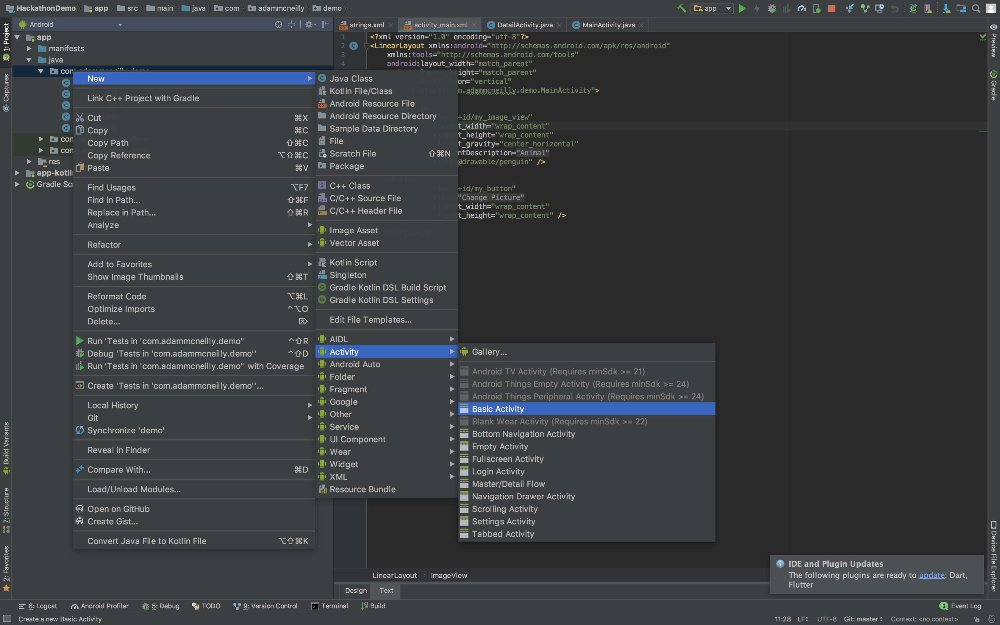

---

# New Activity

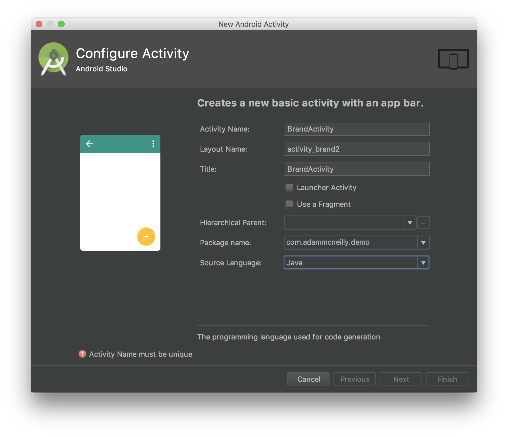

---

# `activity_brand.xml`

[.code-highlight: all]
[.code-highlight: 7-10]
```xml
<LinearLayout xmlns:android="http://schemas.android.com/apk/res/android"
    xmlns:tools="http://schemas.android.com/tools"
    android:layout_width="match_parent"
    android:layout_height="match_parent"
    tools:context="com.adammcneilly.demo.BrandActivity">

    <android.support.v7.widget.RecyclerView
        android:id="@+id/brand_list"
        android:layout_width="match_parent"
        android:layout_height="match_parent"/>

</LinearLayout>
```

---

# RecyclerView Steps

1. Create an object for what you'll display.
2. Create a layout file for the list item.
3. Create a RecyclerView.Adapter

---

# Define A Brand

[.code-highlight: all]
[.code-highlight: 2-3]
```java
public class Brand {
    private String name;
    private int logoResource;

    public Brand(String name, int logoResource) {
        this.name = name;
        this.logoResource = logoResource;
    }

    public String getName() {
        return name;
    }

    public int getLogoResource() {
        return logoResource;
    }
}
```

---

# `list_item_brand.xml`

[.code-highlight: 1-5, 22]
[.code-highlight: 7-12]
[.code-highlight: 14-20]
```xml
<LinearLayout xmlns:android="http://schemas.android.com/apk/res/android"
    android:layout_width="match_parent"
    android:layout_height="wrap_content"
    xmlns:tools="http://schemas.android.com/tools"
    android:orientation="horizontal">

    <ImageView
        android:id="@+id/brand_image"
        android:layout_width="64dp"
        android:layout_height="64dp"
        tools:src="@drawable/apple"
        android:padding="8dp" />

    <TextView
        android:id="@+id/brand_name"
        android:layout_width="wrap_content"
        android:layout_height="match_parent"
        tools:text="Apple"
        android:gravity="center"
        android:textSize="24sp" />

</LinearLayout>
```

---

# ViewHolder

[.code-highlight: all]
[.code-highlight: 4, 20]
[.code-highlight: 5-6]
[.code-highlight: 8-14]
[.code-highlight: 16-19]
```java
public class BrandAdapter {
    // ...
    
    public class BrandViewHolder extends RecyclerView.ViewHolder {
        private ImageView logo;
        private TextView name;

        public BrandViewHolder(View view) {
            super(view);

            // Get view references
            logo = view.findViewById(R.id.brand_image);
            name = view.findViewById(R.id.brand_name);
        }

        public void bindBrand(Brand item) {
            logo.setImageResource(item.getLogoResource());
            name.setText(item.getName());
        }
    }
}
```

---

# Adapter

[.code-highlight: all]
[.code-highlight: 2-6]
[.code-highlight: 8-15]
[.code-highlight: 17-21]
[.code-highlight: 23-26]
```java
public class BrandAdapter extends RecyclerView.Adapter<BrandAdapter.BrandViewHolder> {
    private List<Brand> brands;

    public BrandAdapter(List<Brand> brands) {
        this.brands = brands;
    }

    @NonNull
    @Override
    public BrandViewHolder onCreateViewHolder(@NonNull ViewGroup parent, int viewType) {
        Context context = parent.getContext();
        View view = LayoutInflater.from(context).inflate(R.layout.list_item_brand, parent, false);
        return new BrandViewHolder(view);
    }

    @Override
    public void onBindViewHolder(@NonNull BrandViewHolder holder, int position) {
        Brand item = brands.get(position);
        holder.bindBrand(item);
    }

    @Override
    public int getItemCount() {
        return brands.size();
    }

    public class BrandViewHolder extends RecyclerView.ViewHolder {
        // ...
    }
}
```

---

# Setup RecyclerView

[.code-highlight: all]
[.code-highlight: 17-24]
[.code-highlight: 7-9]
[.code-highlight: 11-14]
```java
public class BrandActivity extends AppCompatActivity {
    @Override
    protected void onCreate(Bundle savedInstanceState) {
        super.onCreate(savedInstanceState);
        setContentView(R.layout.activity_brand);

        List<Brand> brandList = getSampleBrands();
        BrandAdapter adapter = new BrandAdapter(brandList);
        LinearLayoutManager linearLayoutManager = new LinearLayoutManager(this);

        // Setup RecyclerView
        RecyclerView recyclerView = findViewById(R.id.brand_list);
        recyclerView.setLayoutManager(linearLayoutManager);
        recyclerView.setAdapter(adapter);
    }

    private List<Brand> getSampleBrands() {
        List<Brand> brandList = new ArrayList<>();
        brandList.add(new Brand("Apple", R.drawable.apple));
        brandList.add(new Brand("Facebook", R.drawable.facebook));
        brandList.add(new Brand("Google", R.drawable.google));
        brandList.add(new Brand("Microsoft", R.drawable.microsoft));
        return brandList;
    }
}
```

---

# Launch Brand Activity

[.code-highlight: all]
[.code-highlight: 11-24]
```java
public class MainActivity extends AppCompatActivity {
    // ...

    @Override
    protected void onCreate(Bundle savedInstanceState) {
        super.onCreate(savedInstanceState);
        setContentView(R.layout.activity_main);

        // ...

        // Set a long click listener on the button to start our brand activity
        myButton.setOnLongClickListener(new View.OnLongClickListener() {
            @Override
            public boolean onLongClick(View v) {
                startBrandActivity();
                return true;
            }
        });
    }

    private void startBrandActivity() {
        Intent intent = new Intent(MainActivity.this, BrandActivity.class);
        startActivity(intent);
    }
}
```

---

# Progress


---

# Detail Activity

* Follow same new activity steps as in the past.
* Copy XML layout from `activity_main.xml` to `activity_detail.xml` for ease of demonstration.

---

# Detail Activity

[.code-highlight: all]
[.code-highlight: 2-3]
[.code-highlight: 14-16]
[.code-highlight: 10-12, 18-20]
```java
public class DetailActivity extends AppCompatActivity {
    public static final String BRAND_LOGO_KEY = "brandLogo";
    public static final String BRAND_NAME_KEY = "brandName";

    @Override
    protected void onCreate(Bundle savedInstanceState) {
        super.onCreate(savedInstanceState);
        setContentView(R.layout.activity_detail);

        // Get View references
        ImageView imageView = findViewById(R.id.my_image_view);
        Button button = findViewById(R.id.my_button);

        // Get extras from intent
        int logoResource = getIntent().getIntExtra(BRAND_LOGO_KEY, R.drawable.apple);
        String name = getIntent().getStringExtra(BRAND_NAME_KEY);

        // Set values
        imageView.setImageResource(logoResource);
        button.setText(name);
    }
}
```

---

# Launching Detail Activity

[.code-highlight: all]
[.code-highlight: 10-11]
[.code-highlight: 14-26]
```java
public class BrandAdapter extends RecyclerView.Adapter<BrandAdapter.BrandViewHolder> {
    // ...

    public class BrandViewHolder extends RecyclerView.ViewHolder implements View.OnClickListener {
        public BrandViewHolder(View view) {
            super(view);

            // ....

            // Set click listener to view
            view.setOnClickListener(this);
        }

        @Override
        public void onClick(View v) {
            // Get the brand
            Brand brand = brands.get(getAdapterPosition());

            // Build an intent
            Intent intent = new Intent(v.getContext(), DetailActivity.class);
            intent.putExtra(DetailActivity.BRAND_LOGO_KEY, brand.getLogoResource());
            intent.putExtra(DetailActivity.BRAND_NAME_KEY, brand.getName());

            // Launch activity
            v.getContext().startActivity(intent);
        }
    }
}
```

---

# Complete!

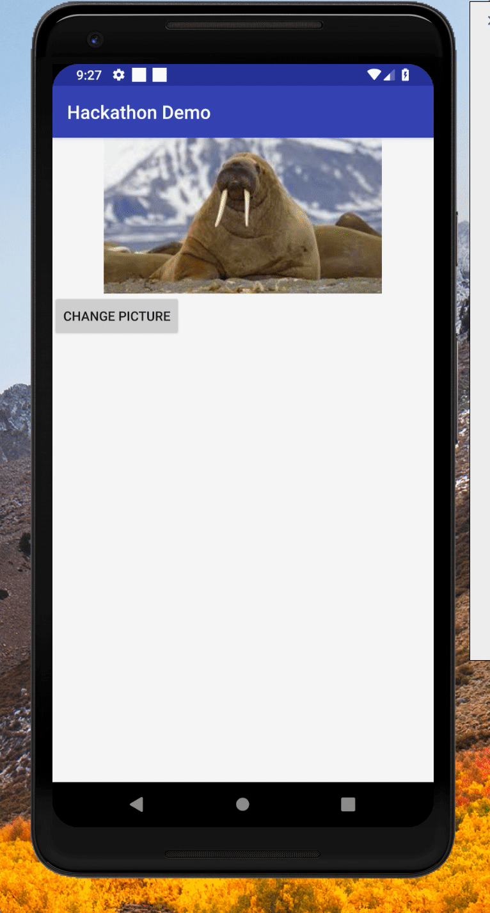

---

# Repo

* https://github.com/adammc331/hackathondemo
* Includes Kotlin module

[.build-lists: false]